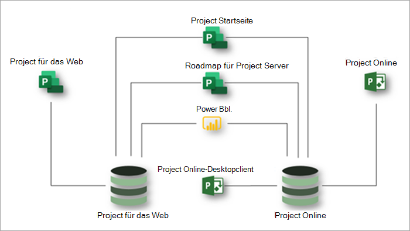

# Microsoft Project – Dienstbeschreibung

## Übersicht

Microsoft Project bietet die folgenden Anwendungen, um die Anforderungen Ihrer Organisation an das Projekt- und Arbeitsmanagement zu erfüllen:

- Project für das Web
- Project Online 
- Project Online-Desktopclient

Dieser Artikel hilft Ihnen zu verstehen, welche Anwendungen in jedem Project-Abonnement bereitgestellt werden und welche Funktionen jede Anwendung bietet.

### Project für das Web

Project für das Web ist das neueste Angebot von Microsoft für cloudbasiertes Arbeits- und Projektmanagement. Project für das Web bietet einfache, leistungsstarke Arbeitsverwaltungsfunktionen, um die meisten Anforderungen und Rollen zu erfüllen. Project Vorgesetzte und Teammitglieder können Project für das Web verwenden, um Aufgaben jeder Größe zu planen und zu verwalten.

Project für das Web basiert auf der Microsoft Power Platform. Die Power Platform besteht aus PowerApps, Power Automate, Power BI und Microsoft Dataverse. Project für die Webdaten werden im Microsoft Dataverse gespeichert. 

Project für das Web ist über drei Abonnements verfügbar: Project Plan 1, Project Plan 3 und Project Plan 5. Features, die in [Project für die Webfeatures](#project-for-the-web-features) aufgeführt sind, interagieren nur mit Daten im Project für den Webdatenspeicher.

### Project Online
 
Project Online ist eine flexible Onlinelösung für Project Portfoliomanagement (PPM) und die tägliche Arbeit. Project Online bietet leistungsstarke Projektmanagementfunktionen für die Planung, Priorisierung und Verwaltung von Projekten und Projektportfolioinvestitionen &mdash; von fast überall auf fast jedem Gerät. Project Online kann von Administratoren, Portfoliomanagern, Portfoliobetrachtern, Projektmanagern, Ressourcenmanagern, Teamleitern und Teammitgliedern verwendet werden.

Project Online basiert auf der SharePoint Plattform und speichert Daten im SharePoint Datenspeicher.

Project Online ist über zwei Abonnements verfügbar: Project Plan 3 und Project Plan 5. In [Project Online Features](#project-online-features) aufgeführte Features interagieren nur mit Daten im Project Online SharePoint Datenspeicher.

Die Teammitgliedsfunktionen für Project Online sind über ein Project Online Essentials- oder Project Plan 1-Abonnement verfügbar. Project Online Essentials ist ein *Add-On-Abonnement* für Teammitglieder für Kunden, die über Project Plan 3- oder Project Plan 5-Abonnements verfügen. Project Online Essentials und Project Plan 1 Abonnements bieten Teammitgliedern eine Webschnittstelle zum Ausführen von Aufgaben- und Zeitupdates für Projekte, die in Project Online verwaltet werden.

Teammitglieder mit Project Online Essentials oder Project Plan 1 Abonnements können die folgenden Project Online Funktionen ausführen:

- Verwenden einer webbasierten Schnittstelle
- Aktualisieren von Aufgaben, Problemen und Risiken
- Übermitteln von Arbeitszeittabellen
- Freigeben von Dokumenten und Zusammenarbeit mit Microsoft Teams oder Skype for Business Benutzern

Project Online Essentials enthält keine Project für das Web. Project Plan 1 enthält sowohl Project für das Web als auch Project Online Essentials.

### Project Online-Desktopclient

Microsoft Project Online Desktopclient ist ein Projektverwaltungsprogramm mit automatisierter Planung, Projektressourcenverwaltung und integrierter Berichterstellung. Project Online Desktopclient kann als eigenständige Anwendung verwendet werden oder eine Verbindung mit Project Online herstellen. Project Online Desktopclient ist die Abonnementversion des Project Professional-Desktopclients und in Project Plan 3- und Project Plan 5-Abonnements verfügbar.

### Gemeinsames Verwenden von Project für das Web und Project Online

Obwohl Project für das Web und Project Online separate Anwendungen sind, können Sie sie nebeneinander verwenden. Sie können alle Ihre Projekte aus beiden Anwendungen in Project Home anzeigen. Sie können die Project Roadmap-Funktion verwenden, um Roadmaps zu erstellen, die Projekte aus beiden Anwendungen enthalten. Und Sie können Power BI und die Project für das Web Power BI Inhaltspaket verwenden, um Einblicke in Projekte und Ressourcen in den beiden Anwendungen zu erhalten. 3

Dieses Diagramm zeigt, wie die Anwendungen nebeneinander zusammenarbeiten können.

Microsoft wird sich in Zukunft auf Project für die Web-Innovationen konzentrieren. Sie können jedoch weiterhin Project Online verwenden, da sie weiterhin wichtige Leistungs- und Sicherheitsverbesserungen erhalten.

## Microsoft Project Abonnements

Microsoft Project ist über drei verschiedene Abonnements verfügbar, um die Anforderungen Ihrer Organisation optimal zu erfüllen. Diese Abonnements sind Project Plan 1, Project Plan 3 und Project Plan 5. Informationen zum Vergleichen von Features über Abonnements hinweg finden Sie unter ["Featureverfügbarkeit für alle Anwendungen und Abonnements".](#feature-availability-across-applications-and-subscriptions)  

|Produkt | Plan 1 | Plan 3 | Plan 5 |
|--------|-----------------------------|------------------------|------------------------|
|Project für das Web |**x**  | **x x** | **x x** |
|Project Online |**x** |**x x**| **x x x** |
|Project Online-Desktopclient | |**x**|**x**|

In der obigen Tabelle gibt die Anzahl der Prüfungen (**x**) die allgemeine Ebene der Funktionen an, die von einem Plan bereitgestellt werden. Beispielsweise bietet Plan 5 für Project Online mehr Funktionen als Plan 3.

## Verfügbarkeit von Features über Anwendungen und Abonnements hinweg

### Project für die Webfeatures

Die in diesem Abschnitt aufgeführten Features interagieren nur mit Daten im Project für den Webdatenspeicher. Alle diese Features sind in allen Microsoft Project Abonnements verfügbar: Project Plan 1, Project Plan 3 und Project Plan 5.  

| Feature | Beschreibung | Office 365 Lizenzen | Plan 1 | Plan 3 | Plan 5 |
|--------|-----------------------------|--------------|------------|------------|------------|
|**Project-, Aufgaben- und Zeitverwaltung**||||||
|Boardansicht | Verfolgen Sie Projektaufgaben visuell für eine verbesserte Workflow- und Statusüberwachung mithilfe von sofort einsatzbereiten und benutzerdefinierten Taskboards.| Nur Ansicht | Ja | Ja| Ja|
|Abhängigkeiten | Festlegen und visuelles Nachverfolgen von Abhängigkeiten zwischen Aufgaben.| Nur Ansicht | Ja | Ja| Ja|
|Rasteransicht | Planen und Verwalten von Projekten mithilfe einer hierarchischen Rasteransicht von Aufgaben. | Nur Ansicht | Ja | Ja | Ja |
|Meilensteine | Wichtige Projekt- und Aufgabenmeiler werden eingerichtet und nachverfolgt.|Nur Ansicht | Ja | Ja | Ja |
|Project Startseite | Nachverfolgen und Verwalten von Lieferumfangn mithilfe von Start- und Endterminen und automatisierter Planung.| Ja | Ja | Ja | Ja |
|Aufgabenplanung | Erhalten Sie einen Überblick über Projekte, an denen Sie kürzlich gearbeitet haben, sowie über wichtige Projekte, die Sie genau überwachen müssen.| Nur Ansicht | Ja | Ja | Ja |
|Zeitachsenansicht (Gantt-Diagramm) | Visuelles Nachverfolgen und Verstehen von Projektdaten, Abhängigkeiten und Zuordnungen in einer hierarchischen Zeitachsenansicht.|Nur Ansicht | Ja | Ja | Ja |
|Sammelvorgänge | Planen, Verwalten und Nachverfolgen von Lieferumfangn und Phasen mithilfe von Sammelvorgängen.| Nur Ansicht | Ja | Ja | Ja |
|Erstellen und Verwenden von benutzerdefinierten Aufgabenfeldern | Hinzufügen lokaler benutzerdefinierter Felder zu Vorgängen in einem Projekt, Hinzufügen von Daten zu diesen Feldern oder Aktualisieren von Daten in diesen Feldern.| Nur anzeigen | Ja | Ja | Ja |
|**Zusammenarbeit** ||||||
|Microsoft Teams Integration | Zusammenarbeit an Projekten in Microsoft Teams. 1 | Ja | Ja | Ja | Ja |
|**Ressourcen- und Programmverwaltung** ||||||
|Project Teameinrichtung | Verwalten Sie ein Projektteam, indem Sie Mitglieder hinzufügen und entfernen und den Arbeitskalender festlegen. | Nein | Ja | Ja | Ja |
|Roadmaps | Erstellen Sie visuelle, interaktive Roadmaps für verschiedene Projekte aus Microsoft Project Online, Microsoft Project für das Web und Azure Boards Projekten. 2 Mit Project Plan 1 erhalten Sie schreibgeschützten Zugriff auf Roadmaps. Mit Project Plan 3 oder Project Plan 5 können Sie auch Roadmaps erstellen. | Nur anzeigen | Nur anzeigen | Ja | Ja |
|**Berichterstellung**3 ||||||
|Lesen von Berichten aus *Project für die Webdaten* | Sehen Sie sich sofort einsatzbereite oder benutzerdefinierte Berichte und Dashboards an, um Projekt-, Programm-, Portfolio- und Ressourcendaten zu verstehen. | Ja | Ja | Ja | Ja |
|Erstellen von Berichten mit *Project für die Webdaten* | Verstehen Sie die für Ihre Organisation wichtigen Daten, indem Sie benutzerdefinierte Berichte erstellen, die auf out-of-box-Berichten oder von Grund auf neu erstellt werden.  Erstellen Sie benutzerdefinierte Dashboards, um bestimmte organisatorische Anforderungen zu erfüllen. | Nein | Ja | Ja | Ja |
|**Usability** ||||||
|Gemeinsame Dokumenterstellung | Arbeiten Sie mit Projektbeteiligten und Teammitgliedern zusammen, um Aufgabenlisten, Projektpläne und vieles mehr gleichzeitig zu erstellen, zu bearbeiten und zu aktualisieren.| Nur Ansicht | Ja | Ja | Ja |
|Grafische Indikatoren | Grundlegendes zu Aufgabenstatus, Aufgaben und mehr mit grafischen Indikatoren.| Nur Ansicht | Ja | Ja | Ja |
|**Anpassung und Integration**||||||
|Verwenden der sofort einsatzbereiten Project Anwendung | Verwenden Sie die sofort einsatzbereite Project Anwendung, um ein Projekt anzuzeigen, ein neues Projekt zu erstellen, einem Projekt neue Daten hinzuzufügen oder vorhandene Projektdaten zu aktualisieren. | Nur anzeigen | Ja | Ja | Ja |
|Anpassen von Ansichten und Formularen 4 | Passen Sie nur Ansichten und Formulare in der sofort einsatzbereiten Project-Anwendung an. | Nur anzeigen | Ja | Ja | Ja |
|Verwenden von benutzerdefinierten Spalten | Anzeigen, Hinzufügen, Aktualisieren oder Löschen von Daten in einer Spalte, die einer Tabelle hinzugefügt wurde. | Nur anzeigen | Ja | Ja | Ja |
|Verwenden von benutzerdefinierten Tabellen 5 | Erstellen und definieren Sie benutzerdefinierte Tabellen, um zusätzliche Daten zu speichern, die Sie für Ihre Projekte, Portfolio usw. benötigen. | Nur anzeigen | Ja | Ja | Ja |
|**Power Automate Workflows and Business Process Flows** 7 ||||||
| | Definieren und verwenden Sie Power Automate Cloud-Flüsse, die Project-Daten einschließlich benutzerdefinierter Tabellen und Spalten nutzen. | Nein | Ja | Ja | Ja |
| | Definieren Von Power Automate-Geschäftsprozessflüssen, die Project-Daten einschließlich benutzerdefinierter Tabellen und Spalten nutzen. | Nein | Nein | Ja | Ja |
| | Verwenden Sie Power Automate Business Process-Flüsse, die Project-Daten nutzen. | Nein | Ja | Ja | Ja |
|**Sicherheit und Benutzerverwaltung**||||||
|Moderne Office-Gruppen | Erstellen Sie ein Projektteam, um mit einer Sammlung von Ressourcen zusammenzuarbeiten und diese einfach einzurichten, die Teammitglieder freigeben können. | Ja | Ja | Ja | Ja |
|**Drittanbieter-Apps**||||||
|Herstellen *einer* Verbindung mit Project für das Web mit Drittanbieter-Apps 4 | Verwenden Sie eine benutzerdefinierte oder Drittanbieteranwendung, um Project-Daten in einer systemeigenen Project-Tabelle anzuzeigen, zu erstellen, zu aktualisieren oder zu löschen. | Nur11 anzeigen | Ja | Ja | Ja |

### Project Online-Features

Die in diesem Abschnitt aufgeführten Features interagieren nur mit Daten im SharePoint-Datenspeicher von Project Online. Teammitglieder mit Project Online Essentials- oder Project Plan 1-Abonnements können einige Project Online-Funktionen ausführen. Weitere Informationen finden Sie unter [Microsoft Project-Dienstbeschreibung – Dienstbeschreibungen | Microsoft Docs](/office365/servicedescriptions/project-online-service-description/project-online-service-description#project-online).  

|Feature | Beschreibung | Projektplan 3 | Projektplan 5 |
|--------|-------------|-----------------------------|------------------------|
|**Projekt-, Aufgaben- und Zeitverwaltung**||||
|Warnungen und Erinnerungen | Bleiben Sie mit Erinnerungen in Outlook und Microsoft Teams auf dem Zeitplan für wichtige bevorstehende Aufgaben und Projektereignisse. 1| Ja | Ja |
|Basislinien | Legen Sie Projektgrundwerte fest, um die aktuelle Leistung mit der Leistung der Vergangenheit mithilfe der Project Web App zu überwachen.| Ja | Ja |
|Boardansicht | Verfolgen Sie Projektaufgaben visuell für eine verbesserte Workflow- und Statusüberwachung. | Ja | Ja |
|Kritischer Pfad | Verfolgen Sie die Aufgaben, die den längsten Pfad durch das Projekt darstellen, visuell mithilfe der Project Web App.| Ja | Ja |
|Lieferumfangverwaltung | Nachverfolgen und Verwalten von Lieferumfangn mithilfe von Start- und Endterminen und automatisierter Planung.| Ja | Ja |
|Abhängigkeiten | Festlegen und visuelles Nachverfolgen von Abhängigkeiten zwischen Aufgaben.| Ja | Ja |
|Gantt-Ansicht | Visuelles Nachverfolgen und Verstehen von Projektdaten, Abhängigkeiten und Zuordnungen in einem hierarchischen Gantt-Diagramm mithilfe der Project Web App.| Ja | Ja |
|Rasteransicht | Planen und Verwalten von Projekten mithilfe einer hierarchischen Rasteransicht von Aufgaben mithilfe der Project Web App.| Ja | Ja |
|Problem- und Risikomanagement | Identifizieren und Nachverfolgen von Problemen und Risiken auf Projekt- und Aufgabenebene.| Ja | Ja |
|Hauptprojekte | Gruppieren Sie kleinere verwandte Projekte unter einem einzigen Hauptprojekt mithilfe der Project Web App. | Ja | Ja |
|Benachrichtigungen | Bleiben Sie über Aufgabenzuweisungen, Status und wichtige Projektereignisse mit Outlook- und Teams-Benachrichtigungen auf dem Laufenden. 1 | Ja | Ja |
|Projektstart | Erhalten Sie einen Überblick über Projekte, an denen Sie kürzlich gearbeitet haben, sowie über wichtige Projekte, die Sie genau überwachen müssen.| Ja | Ja |
|Project-Versionsverwaltung | Vergleichen Sie verschiedene Versionen eines Projekts mit einem Bericht, der anzeigt, was sich zwischen den Versionen geändert hat. | Ja | Ja |
|Sammelvorgänge | Planen, Verwalten und Nachverfolgen von Lieferumfangn und Phasen mithilfe von Sammelvorgängen in der Project Web App. | Ja | Ja |
|Aufgabenplanung | Verwenden Sie Anfangs- und Endtermine, Aufwand, Arbeit, Lead- und Verzögerungszeiten von Aufgaben sowie Abhängigkeiten, um mithilfe der Project Web App einen genauen Zeitplan für Projektdaten zu erhalten. | Ja | Ja |
|Aufgabenupdates | Erfassen Sie Zeit und Status mit Kommentaren zu Projektaufgaben, nicht projektbezogenen und arbeitsfreien Zeiten. | Ja | Ja |
|Zeitpläne | Visuelles Nachverfolgen und Verstehen von Projektdaten, Abhängigkeiten und Zuordnungen in einer Zeitachsenansicht mithilfe der Project Web App. | Ja | Ja |
|Arbeitszeittabellen | Teammitglieder können Zeit und Status für Vorgänge, Nicht-Projektarbeit und arbeitsfreie Zeit eingeben. | Ja | Ja |
|Arbeitszeittabellengenehmigungen | Teammitglieder können Arbeitszeittabellen zur Genehmigung übermitteln. Ressourcenmanager und Vorgesetzte können übermittelte Arbeitszeittabellen überprüfen, genehmigen und ablehnen. | Ja | Ja |
|Nicht-Arbeitszeiteinrichtung | Fügen Sie dem Projektzeitplan Urlaube, Feiertage, gesundheitsbedingte Abwesenheiten und andere arbeitsfreie Zeiten hinzu. | Nein | Ja |
|**Zusammenarbeit** ||||
|Anlagen | Fügen Sie Dokumente, Bilder und andere Dateien auf Team-, Projekt- oder Aufgabenebene an. Verwalten Sie diese Anlagen in einer zentralen Bibliothek auf Team- oder Projektebene. | Ja | Ja |
|Externe Teammitglieder |Arbeiten Sie mit Personen von außerhalb Ihrer Organisation zusammen, indem Sie ihnen Zugriff gewähren, um Ihre Projekte, Aufgaben und Dokumente anzuzeigen und mit ihnen zu interagieren. 6 | Ja | Ja |
|Projektwebsites | Erstellen und Anpassen eines Hubs für die Zusammenarbeit und Dokumente für ein Projekt. | Ja | Ja |
|Microsoft Teams-Integration | Zusammenarbeit an Projekten in Microsoft Teams. 1 | Ja | Ja |
|**Bedarfsmanagement** ||||
|Einrichtung des Workflows für die Genehmigung von Projektanforderungen | Erstellen Sie die Workflows, die Sie benötigen, um eingehende Anforderungen zu bewerten, zu priorisieren und zu genehmigen. | Nein | Ja |
|Erstellen von Project-Anforderungsformularen | Erfassen Sie wichtige Daten über eingehende Anforderungen, um neue Arbeit zu bewerten und zu priorisieren. | Nein | Ja |
|Project-Anforderungen | Nachverfolgen, Verwalten, Bewerten und Priorisieren eingehender Anforderungen aus Ihrer Organisation und von externen Kunden und Partnern. | Ja | Ja |
|**Ressourcen-, Programm- und Portfolioverwaltung** ||||
|Projektkosten und -budgetierung | Vergleichen Sie den geplanten Fortschritt und das Budget mit der aktuellen Zeit und den Aktuellen Kosten mithilfe der Project Web App. | Ja | Ja |
|Setup des Projektteams | Verwalten Sie ein Projektteam, indem Sie Mitglieder hinzufügen und entfernen, Zuweisungsebenen festlegen und externe Mitglieder hinzufügen. | Ja | Ja |
|Ressourcenkapazitätsansichten | Nachverfolgen und Verwalten der Ressourcenkapazität auf Projekt-, Team- und Organisationsebene. | Ja | Ja |
|Ressourcenkosten | Nachverfolgen und Verwalten der Ressourcenkosten Ihres Projekts. | Ja | Ja |
|Ressourcenaktivierungen (Buchungen) | Projektmanager können Anforderungen für Ressourcen nach Rolle, Fähigkeiten oder Name übermitteln. Ressourcenmanager können Anforderungen überprüfen und die besten verfügbaren Ressourcen zuweisen. |Ja8 | Ja9 |
|Ressourcenkapazitätsplanung | Nachverfolgen und Verwalten der Ressourcenkapazität auf Projekt-, Team- und Organisationsebene. | Nein | Ja |
|Roadmaps | Erstellen Sie visuelle, interaktive Roadmaps für Projekte aus Microsoft Project Online-, Microsoft Project für das Web- und Azure Boards-Projekten. 2 | Ja | Ja |
|Portfolioanalyse und Priorisierung | Identifizieren, auswählen und bereitstellen Sie Projektportfolios, die am besten mit der Geschäftsstrategie Ihrer Organisation übereinstimmen, und maximieren Sie Ihre Rendite (Return on Investment, ROI). | Nein | Ja |
|Dashboards/Portale | Grundlegendes zu Status, Priorisierung und mehr auf Portfolio-, Programm-, Projekt-, Aufgaben-, Team- und Ressourcenebene mit interaktiven Dashboards in Echtzeit. | Ja | Ja |
|Work, generic, and material resources | Fügen Sie Ressourcen zu einem Projekt hinzu, z. B. Arbeitsressourcen wie Personen, generische Ressourcen wie Zieren und Materialressourcen wie Computer und Materialressourcen. | Ja | Ja |
|**Berichterstellung**3 ||||
|Out-of-Box-Berichterstellung | Verwenden Sie vordefinierte Berichte, um Projekt-, Programm-, Portfolio- und Ressourcendaten zu verstehen. | Ja | Ja |
|Benutzerdefinierte Berichte | Verstehen Sie die für Ihre Organisation wichtigen Daten, indem Sie benutzerdefinierte Berichte erstellen, die auf out-of-box-Berichten oder von Grund auf neu erstellt werden. | Ja | Ja |
|Dashboards und Portale | Erstellen Sie benutzerdefinierte Dashboards und Portale, um bestimmte organisatorische Anforderungen zu erfüllen. | Ja | Ja |
|**Anpassung und Integration**||||
|Benutzerdefiniertes Branding | Passen Sie Ihre Project Bereitstellung mit Ihrer eigenen Marke, Ihrem Logo und Ihren eigenen Farben an. | Nein | Ja |
|Custom fields | Fügen Sie benutzerdefinierte Felder auf Projekt-, Vorgangs- und Ressourcenebene hinzu, um Daten nachzuverfolgen, die für Ihre Organisation und Ihre Projekte wichtig sind. | Ja | Ja |
|Formeln | Berechnen und erfassen Sie wichtige Daten mithilfe von Formeln für Vorgänge und Projekte. | Ja | Ja |
|PowerApps | Erstellen und Nutzen von Lösungen für Web und Mobile (über OData) mit PowerApps. 4 | Ja | Ja |
|Workflows | Automatisieren und Integrieren von Geschäftsprozessen (über OData) mit Power Automate. 7 | Ja | Ja |
|Microsoft 365-Integration | Zusammenarbeiten, Verwalten von Dokumenten und vieles mehr mit vertrauten Microsoft-Tools und -Anwendungen. 1 | Ja | Ja |
|Microsoft Planner-Integration | Verbinden Project Aufgaben zu einem Planner-Plan und nachverfolgen Detaillierte Arbeit in Planner. 1 | Ja | Ja |
|**Sicherheits-, Benutzer- und Dienstverwaltung**||||
|Active Directory-Integration | Erstellen Sie Teams aus einem beliebigen Mitglied des Active Directory Ihrer Organisation. 10 | Ja | Ja |
|Benutzerverwaltung | Verwalten von Benutzer- und Gruppenrollen und -berechtigungen auf Projekt-, Team- und Organisationsebene. | Nein | Ja |
|Dienstverwaltung | Planen, installieren und konfigurieren, warten und erweitern Sie Ihre Microsoft Project Umgebung als Teil Ihrer Office 3651-Umgebung. | Nein | Ja |

#### Notes

1 Erfordert ein Office oder Microsoft 365 kommerzielles Abonnement. 
2 Azure Boards separat erworben. 
3 Die Berichterstellung für Project für das Web und Project Online mit Power BI erfordert eine Power BI Lizenz. 
4 Für das Erstellen und Verwenden separater Power Apps über die sofort einsatzbereite Project Anwendung hinaus, die auf Project für das Web oder Project Online Kundendaten zugreift, ist ein separates Power Apps Abonnement erforderlich. 
5 Beschränkt auf 5 benutzerdefinierte Tabellen. 
6 Project Online Lizenzierung für externe Benutzer folgt derselben Richtlinie wie für interne Benutzer. Jede Interaktion auf einer Project Online Website erfordert ein Project Plan 3 oder Project Plan 5 Abonnement. 
7 Power Automate Verwendung in Project ist auf den Kontext der Project Anwendung beschränkt. Dies bedeutet, dass in Project enthaltene Flussberechtigungen für Trigger und Aktionen folgende Möglichkeiten haben:

- Verbinden zu einer beliebigen Datenquelle innerhalb der Nutzungsrechte der Project Anwendung:
  - Datenquellen, die über Standardconnectors verfügbar sind
  - Project von Daten über den Microsoft Dataverse-Connector
- Direkt innerhalb der Project Anwendung ausgelöst werden (über integrierten Trigger/Aktion)

Wenn der Fluss isoliert ist und nichts mit der Project Anwendung zu tun hat, muss eine Plattformlizenz erworben werden. 
8 Benutzer mit einem Project Plan 3 oder Project Plan 5 Abonnement können Ressourcen-Engagement-Anforderungen senden. Sie können Ressourceneinsatzanforderungen nicht überprüfen, erfüllen oder genehmigen. 
9 Benutzer mit einem Project Plan 5 Abonnement können Ressourcen-Engagement-Anforderungen überprüfen, erfüllen und genehmigen. 
10 Active Directory erfordert ein separates Abonnement.  
11 Nur Berechtigungen anzeigen werden nur innerhalb einer Power App gewährt.  

### Project Online Desktopclientfeatures

| Feature | Beschreibung |
|--------|-------------|
|**Project und Aufgabenverwaltung**||
|Basislinien | Legen Sie Projektgrundwerte fest, um die aktuelle Leistung im Vergleich zur früheren Leistung zu überwachen. |
|Kalenderansicht | Nachverfolgen wichtiger Projekt- und Aufgabentermine und Meilensteine in einer wöchentlichen oder monatlichen Kalenderansicht. |
|Kritischer Pfad | Verfolgen Sie visuell die Aufgaben, die den längsten Pfad durch das Projekt darstellen. |
|Stichtage | Einrichten und Nachverfolgen wichtiger Projekt- und Aufgabentermine. |
|Abhängigkeiten | Festlegen und visuelles Nachverfolgen von Abhängigkeiten zwischen Aufgaben. |
|Gantt-Ansicht | Visuelles Nachverfolgen und Verstehen von Projektdaten, Abhängigkeiten und Zuordnungen in einer hierarchischen Gantt-Ansicht. |
|Rasteransicht | Planen und Verwalten von Projekten mithilfe einer hierarchischen Rasteransicht von Aufgaben. |
|Hauptprojekte | Gruppieren Sie kleinere verwandte Projekte unter einem einzigen Hauptprojekt. |
|Meilensteine | Wichtige Projekt- und Aufgabenmeiler werden eingerichtet und nachverfolgt. |
|Netzwerkdiagramm | Zeigen Sie Aufgaben, Abhängigkeiten und den kritischen Pfad Ihres Projekts in einer Netzwerkdiagrammansicht an. |
|Aufgabenplanung | Verwenden Von Anfangs- und Endterminen für Vorgänge, Aufwand, Arbeit, Lead- und Verzögerungszeiten und Abhängigkeiten, um einen genauen Zeitplan für Projekttermine zu erhalten |
|Teamplaner | Verfolgen Sie die Zuordnung und Kapazität aller Teammitglieder des Projekts, einschließlich der Nicht-Projektarbeit und der Nicht-Arbeitszeit.|
|Zeitpläne | Visuelles Nachverfolgen und Verstehen von Projektdaten, Abhängigkeiten und Zuordnungen in einer Zeitachsenansicht. |
|Inaktive Vorgänge | Verwenden Sie inaktive Vorgänge, um Arbeit nachzuverfolgen, ohne die Ressourcenverfügbarkeit oder -zuordnung zu beeinträchtigen und ohne den Projektzeitplan zu beeinträchtigen. |
|Sammelvorgänge | Planen, Verwalten und Nachverfolgen von Lieferumfangn und Phasen mithilfe von Sammelvorgängen. |
|Vorgangsinspektor | Zeigen Sie Faktoren an, die Einfluss auf die Planung eines Vorgangs haben, z. B. ein geändertes Startdatum oder Fehlermeldungen. |
|Aufgabenpfadanalyse | Zeigen Sie an, wie ein Vorgang sich mit einem anderen verbindet, indem Sie den Aufgabenpfad im gesamten Projekt hervorheben. |
|**Ressourcen- und Finanzmanagement**||
|Kapazitätsabgleich | Lösen Sie Ressourcenkonflikte oder Überlastungen, indem Sie die Zuordnungen automatisch abgleichen. |
|Arbeits- und Materialressourcen sowie generische Ressourcen | Fügen Sie Ressourcen zu einem Projekt hinzu, z. B. Arbeitsressourcen wie Personen, generische Ressourcen wie Zieren und Materialressourcen wie Computer und Materialressourcen. |
|Project Kosten und Budgetierung | Vergleichen Sie den geplanten Fortschritt und das Budget mit der aktuellen Zeit und den Aktuellen Kosten. |
|Ressourcenkosten | Nachverfolgen und Verwalten der Ressourcenkosten Ihres Projekts.|
|**Berichterstellung** ||
|Benutzerdefinierte Berichte | Erstellen sie benutzerdefinierte Berichte für Projekte, Programme, Portfolio und Ressourcen. |
|Out-of-Box-Berichterstellung | Verwenden Sie vordefinierte Berichte, um Projekt-, Programm-, Portfolio- und Ressourcendaten zu verstehen. |
|PDF and XPS output | Speichern Sie eine Project-Datei als PDF- oder XPS-Datei. |
|**Usability**||
|Automatische Vervollständigung | Erhalten Sie während der Eingabe Vorschläge für Vorgangs- oder Ressourcennamen und Abhängigkeiten. |
|Gefilterte Ansichten | Filtern von Projektplänen nach einem beliebigen Wert im Plan |
|Grafische Indikatoren | Grundlegendes zu Aufgabenstatus, Aufgaben und mehr mit grafischen Indikatoren. |
|Rückgängigmachen auf mehreren Ebenen | Rückgängigmachen mehrerer Änderungen gleichzeitig mithilfe des **Menüs "Rückgängig".** |
|Sortieren und Gruppieren | Verwenden Sie benutzerdefinierte Sortierung und Gruppierung, um eine fokussierte Ansicht Ihres Projekts, Ihrer Aufgaben und Ressourcen zu erhalten.|
|**Anpassung und Integration**||
|Benutzerdefinierte Felder | Fügen Sie benutzerdefinierte Felder auf Projekt-, Vorgangs- und Ressourcenebene hinzu, um Daten nachzuverfolgen, die für Ihre Organisation und Ihre Projekte wichtig sind. |
|Formulare | Erstellen und Bereitstellen von benutzerdefinierten Formularen zum Erfassen wichtiger Projektdaten. |
|Formeln | Berechnen und erfassen Sie wichtige Daten mithilfe von Formeln für Vorgänge und Projekte. |
|Vorlagen | Erstellen Sie Vorlagen für allgemeine Projekte, einschließlich Projektplänen, Teams und Aufgaben. |
|MPP-Import/Export | Erstellen Sie neue Projekte aus vorhandenen MPP-Dateien oder erstellen Sie eine MPP-Datei eines vorhandenen Projekts. |
|Excel Importieren/Exportieren | Erstellen Sie neue Projekte aus Excel Dateien oder erstellen Sie eine Excel Datei eines vorhandenen Projekts. |

## Überlegungen zum Dienst

> [!NOTE]
> Project für das Web ist derzeit für GCC, GCC High und DoD nicht verfügbar. Wir arbeiten daran, Ihnen Project für das Web zu liefern, können aber derzeit keinen festen Zeitrahmen freigeben.

### Hinweise zur Lizenzierung

- Jede Interaktion auf einer Project Online Website erfordert mindestens ein Project Plan 3 oder Project Plan 5 Abonnement innerhalb des Mandanten.
- Wenn Ihr letztes Project Plan 1-, Project Plan 3- oder Project Plan 5-Abonnement abläuft, wird Ihre Project für die Webinstanzen erst automatisch gelöscht, wenn Sie keine aktiven Abonnements haben, die von Microsoft Dataverse abhängig sind.
- Wenn Ihr letztes Project Plan 3- oder Project Plan 5-Abonnement abläuft, werden Ihre Project Online Instanzen nach 120 Tagen gelöscht.
- Bei Project Online Testabonnements werden Ihre Testinstanzen 30 Tage nach Ablauf des Testzeitraums gelöscht.
- For Project for the web trial subscriptions, your trial instances will not be deleted until you have no active subscriptions that depend on the Microsoft Dataverse.

### Verwenden von SharePoint Online

Project Online erfordert die Verwendung von SharePoint Online, die als Teil von Project Online bereitgestellt wird. Die Rechte an den SharePoint Onlinefunktionen, die mit Project Plan 3 oder Project Plan 5 Abonnements bereitgestellt werden, sind auf das Speichern und Zugreifen auf Daten beschränkt, um Project Online zu unterstützen.

### Project Roadmap und Power Automate

Project Die Roadmap erfordert die Verwendung von Power Automate, die als Teil Ihres Project-Abonnements bereitgestellt wird. Die Rechte auf Power Automate Funktionalität sind auf die Power Automate Funktionen beschränkt, die von Project Roadmap benötigt werden. Power Automate Funktionalität, die von Project Roadmap benötigt wird, wird als **Datenintegration für Project mit Flow** Serviceplan im Abschnitt **"Apps"** des Microsoft 365 Admin Center angezeigt.

### Project für das Web und Microsoft Dataverse

Project für das Web erfordert die Verwendung von Microsoft Dataverse zum Speichern seiner Daten. Eine Microsoft Dataverse-Datenbank wird als Teil Ihres Project Abonnements bereitgestellt. Rechte an Microsoft Dataverse-Funktionen sind auf das Speichern und Zugreifen auf Daten beschränkt, um Project für das Web zu unterstützen. Microsoft Dataverse-Funktionen, die von Project benötigt werden, werden im Abschnitt **"Apps"** des Microsoft 365 Admin Center als **allgemeiner Datendienst für** Project Serviceplan angezeigt.

Für Project Kunden mit fünf (5) oder mehr Project für die Weblizenzen können Project für das Web Kunden in Power Platform Production- und Sandbox-Umgebungen bereitstellen.

| Eingeschlossene/fällige Kapazität                                      | Project P1 | Project P3 | Project P5 |
|--------------------------------------------------------------------|------------|------------|------------|
| Dataverse-Datenbank (früher Common Data Service): Eingeschlossen/Mandant | 3 GB        | 5 GB        | 5 GB        |
| Dataverse Database: Accrued/User Subscription License (USL)        | 50 MB       | 250 MB      | 250 MB      |
| Dataverse Log: Included/tenant                                     | 2 GB        | 2 GB        | 2 GB        |
| Dataverse-Datei: Eingeschlossen/Mandant                                    | 20 GB       | 20 GB       | 20 GB       |
| Dataverse-Datei: Accrued/USL                                        | 400 MB      | 2 GB        | 2 GB        |

### Datensicherung und -aufbewahrung

Project für das Web und Project Online verfügen über dieselbe Datensicherungs- und Aufbewahrungsrichtlinie wie Office 365. Ausführliche Informationen finden Sie unter [Datenaufbewahrung, Löschung und Vernichtung in Office 365.](/office365/Enterprise/office-365-data-retention-deletion-and-destruction-overview)

### Datenverschlüsselung

- Weitere Informationen zur Datenverschlüsselung in Project Online finden Sie unter [Datenverschlüsselung in OneDrive for Business und SharePoint Online – Microsoft 365 Compliance | Microsoft-Dokumente](/microsoft-365/compliance/data-encryption-in-odb-and-spo)
- Weitere Informationen zur Datenverschlüsselung in Project für das Web finden Sie unter ["Verschlüsselung in Microsoft Dynamics 365 – Microsoft 365 Compliance | Microsoft-Dokumente](/microsoft-365/compliance/office-365-encryption-in-microsoft-dynamics-365)

### Project für die Webgrenzen und -beschränkungen

Project für das Web hat einige Einschränkungen, die in der folgenden Tabelle beschrieben werden.  

| Entität/Feld | Grenzwert |
|-------------|-------|
|**Aufgabe** ||
|Max. Hierarchieebene für Aufgabe | 10 Ebenen |
|Max. Verknüpfungen (Nachfolger + Vorgänger) für einen Vorgang | 20 |
|Max. Dauer des blattförmigen Vorgangs | 1250 Tage |
|Max. Dauer des Sammelvorgangs | 3650 Tage (10 Jahre) |
|Max. Ressourcen, die einem Vorgang zugewiesen werden können | 20 Ressourcen |
|Unterstützter Datumsbereich für Vorgang | 1.01.1984 &ndash; 31.12.2149 |
|**Projekt** ||
|Max. Gesamtanzahl der Vorgänge für das Projekt | 500 |
|Max. Gesamtdauer des Projekts | 3650 Tage (10 Jahre) |
|Max. Gesamtressourcen für das Projekt | 150 |
|Max. Gesamtlinks (nur Nachfolger) für das Projekt | 600 |

### Project Online Grenzen und Einschränkungen

Project Online hat einige Einschränkungen. Ausführliche Informationen finden Sie unter [Project Online: Softwarebeschränkungen und -beschränkungen.](https://support.office.com/article/5A09DBCE-1E68-4A7B-B099-D5F1B21BA489)
